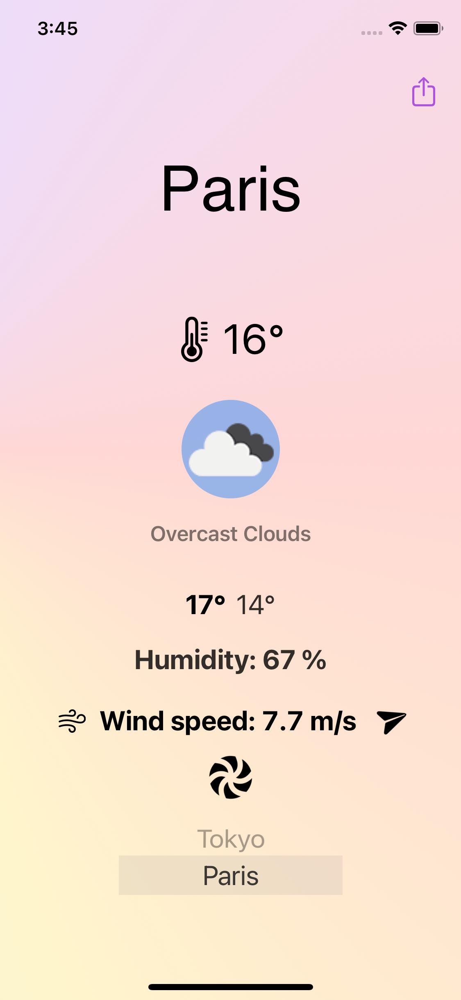
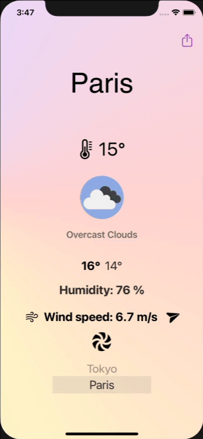
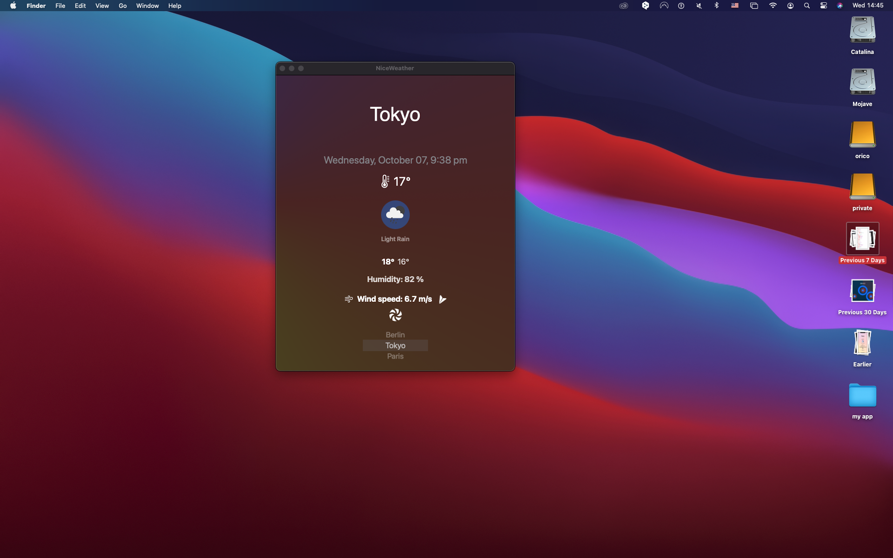

&nbsp;&nbsp;&nbsp;&nbsp;&nbsp;

# Nice Weather App

### Weather App Challenge
Build a small app which displays a weather forecast for Berlin using http://openweathermap.org/

#### Requirements
- Application can be easily extended to support more cities (list of cities included with app)
- Weather detail screen uses images from the API response
- Wind speed value presented with animation.

#### Bonus
- Alternative layout for bigger screens
- Allow sharing of weather to other people
- Unit test

## The execution

The app is entirely written in Swift without external libraries. I developed the app using the new Apple framework SwiftUI universal.
It will work on iPhone iPad and even on macOS using Catalyst (the share button is UIKit only and will not work therefore it will not be displayed for now).


<br>
<p align="center">
  &nbsp;&nbsp;&nbsp;&nbsp;&nbsp;
&nbsp;&nbsp;&nbsp;&nbsp;&nbsp;
&nbsp;&nbsp;&nbsp;&nbsp;&nbsp;
</p>
<br></br>
 

<br>
<p align="center">
  &nbsp;&nbsp;&nbsp;&nbsp;&nbsp;
&nbsp;&nbsp;&nbsp;&nbsp;&nbsp;
</p>
<br></br>
 

<br>
<p align="center">
  
  </p>
<br></br>

### The API
This is a preview of the API response for Berlin using http://openweathermap.org/ 

```json
{
  "coord": {
    "lon": 13.41,
    "lat": 52.52
  },
  "weather": [
    {
      "id": 701,
      "main": "Mist",
      "description": "mist",
      "icon": "50d"
    }
  ],
  "base": "stations",
  "main": {
    "temp": 285.2,
    "feels_like": 285.14,
    "temp_min": 283.15,
    "temp_max": 288.15,
    "pressure": 1008,
    "humidity": 100
  },
  "visibility": 1000,
  "wind": {
    "speed": 1,
    "deg": 0
  },
  "clouds": {
    "all": 75
  },
  "dt": 1601541645,
  "sys": {
    "type": 1,
    "id": 1275,
    "country": "DE",
    "sunrise": 1601528872,
    "sunset": 1601570629
  },
  "timezone": 7200,
  "id": 2950159,
  "name": "Berlin",
  "cod": 200
}
```

### The Model
The model is independent of the view and closely matches the response I get from the API.
From the API response, I built the model as a struct conforming to the Codable protocol. From the docs, I read that some of these variables are not guaranteed to exist in every API response so I will make them optional.

```swift
struct CurrentWeather: Codable {
    var coord: Coordinates
    var weather: [Weather]
    var main: MainWeatherData
    var visibility: Double
    var wind: Wind
    var clouds: Cloud
    var dt: Date
    var timezone: Int
    var id: Int
    var name: String
    var cod: Int

    struct Coordinates: Codable {
        var lat: Double
        var lon: Double
    }
    [...]

}
```

### The ViewModel

The ViewModel will use the model to convert the API call to data for our views. It will be a class conforming to the `ObservableObject` protocol and use a property wrapper `@Published` to pass the data to our views. When published property changes, SwiftUI will refresh our views automatically. This class will be our source of truth!

```swift
class WeatherModel: ObservableObject {
    
    @Published private(set) var currentWeather: CurrentWeather?
    
    @Published var currentLocation: Location = loadLastLocation() {
        didSet {
            persistLastLocation()
        }
    }
    
    [...]
```
Also the app will remember the last selected city or preferred city. which will be stored in the UserDefaults:

```swift
    static func loadLastLocation() -> Location {
        let savedLastLocation = UserDefaults.standard.object(forKey: WeatherModel.lastLocationKey)
        if let lastLocation = savedLastLocation as? Data {
            let decoder = JSONDecoder()
            return (try? decoder.decode(Location.self, from: lastLocation)) ?? WeatherModel.defaultLastLocation
        }
        return WeatherModel.defaultLastLocation
    }
```
In SwiftUI we do not have the files AppDelagate.swift and Scene.swift anymore. Instead we have the main struct:

```swift
import SwiftUI

@main
struct NiceWeatherApp: App {
    var body: some Scene {
        WindowGroup {
            ContentView()
        }
    }
}
```

### The NetworkManager
I create a separate `NetworkManager` class which will take care of my network calls. In this class, I will call its method `getWeather(for city:country:)` from my ViewModel to get the current weather data and pass it to the view.
In the same class, I have a function to download the image icons provided and I implemented a cache, so we do not need to download the image twice. The images have a very small size in any case, and this will not cause any storage problems.

### ATS - Apple Transport Security
Clearly Apple doesnt like URL's starting with `HTTP`. I got the error message:
>2020-10-02 14:42:14.713320+0200 NiceWeather[98370:5805877] App Transport Security has blocked a cleartext HTTP (http://) resource load since it is insecure. Temporary exceptions can be configured via your app's Info.plist file.

I only need to add this to my `.plist` file:

```
    <key>NSAppTransportSecurity</key>
    <dict>
        <key>NSAllowsArbitraryLoads</key>
        <true/>
    </dict>
```

### My Data
I display in the console the converted JSON data and lay the values in the view passing an instance of my model.
I will add a picker with a list of cities to choose from. This can be customized later to add more cities, or the user can add cities to the app.
For the wind animation, I will use an icon in SF Symbols which will rotate with a speed depending on the intensity of the wind. The wind direction will be indicated by a `paperplane` icon.

### Accessibility
Where needed I added labels to buttons that would be difficult for Voiceover to spell like in the sharing button:
```
            .navigationBarItems(trailing:
                Button(action: {}) {Image(systemName: "square.and.arrow.up")
                                    .accessibility(label: Text("share"))
                })
```

### Layout for bigger screens
The layout would not change for my app but I tweaked the sizes of the button and the title to make it bigger on the iPad. I think it looks good but can be improved further.

### Unit tests
I added some Unit and UITests but are by no mean exhaustive and can be improved further.

### To do

Still to do:
- Add a button giving the user to edit the list of locations in the picker.
- display an alert when the user runs out of API calls in the free subscription model.

### Resources used
- jsonbeautify to display and validate JSON files: https://jsonbeautify.com
- App Icon from Icons made by <a href="https://www.flaticon.com/authors/freepik" title="Freepik">Freepik</a> from <a href="https://www.flaticon.com/" title="Flaticon"> www.flaticon.com</a> and resized with [Sketch](https://www.sketch.com) 
